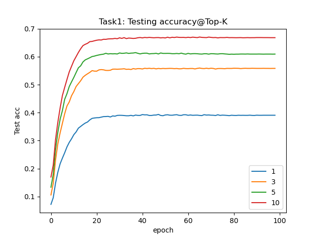
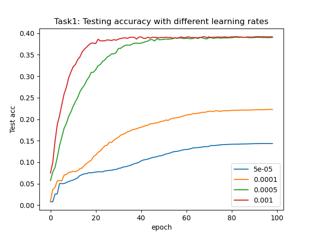
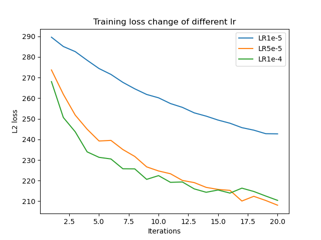
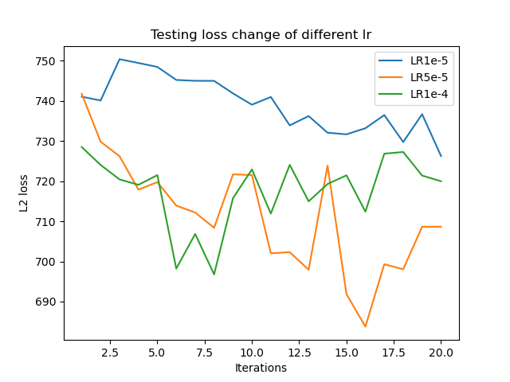
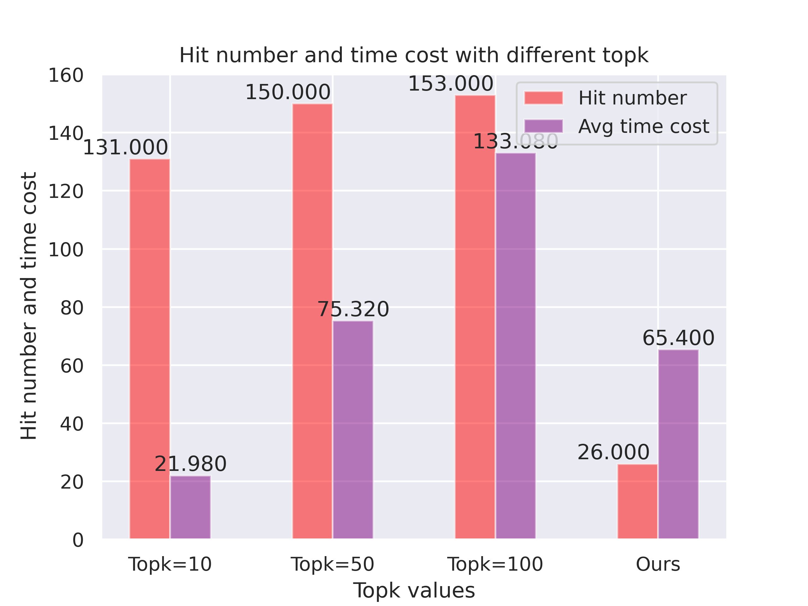

# Retrosynthetic-Planning
This is the course projects for CS3318 Machine Learning

#### run task1
```
cd task1
python main.py
```

#### run task2
```
cd task2
python main.py --lr <learning rate> --device <gpu number> --num_epochs <num_epochs> 
```

#### run task3

```
cd task3
python main.py --aid_model (use pretrained model)
python main.py (use our model)
```

#### Results





